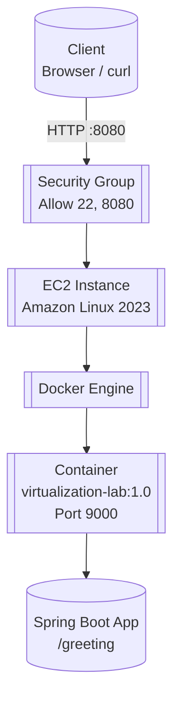

# Containerizing and Deploying a Java Web Application

## Description

This workshop explores virtualization as an architectural mechanism for modularity, isolation, portability, and deployment. A minimal Java web application is built with Spring Boot, packaged as a Docker image, run locally in isolated containers, published to Docker Hub, and deployed on an Amazon EC2 virtual machine. The deployment model is analyzed and infrastructure costs are estimated for different transaction volumes.

## Workshop Objectives

- Build and run a minimal Java web application with Spring Boot
- Configure an application through environment variables
- Package an application as a Docker image
- Run multiple isolated container instances on one host
- Publish an image to Docker Hub
- Deploy and verify a containerized application on AWS EC2
- Describe the architecture of a VM and container-based deployment
- Estimate infrastructure cost for different workload levels
- Document a deployment with technical evidence

## Technologies

- Java 21 LTS (Amazon Corretto 21)
- Maven 3.9+
- Spring Boot 4.1.1
- Docker Desktop with Docker Compose v2
- Docker Hub
- Amazon Linux 2023 on AWS EC2
- MongoDB 8 (Docker Compose only)

## Prerequisites

- Java 21 or later
- Maven 3.9+
- Git and a GitHub account
- Docker Desktop installed and running
- A Docker Hub account
- An AWS account with permission to create EC2 instances
- Basic experience developing Java web applications

## Project Structure

```
.
├── pom.xml
├── Dockerfile
├── compose.yaml
├── src/
│   └── main/java/co/edu/escuelaing/virtualizationlab/
│       ├── RestServiceApplication.java
│       └── HelloRestController.java
└── README.md
```

## Local Execution

### Build

```bash
mvn clean package
```

This compiles the source code, runs tests, and produces a fat JAR at `target/virtualization-lab-1.0.0.jar` with all dependencies included.

### Run

Using Maven:

```bash
mvn spring-boot:run
```

Using the JAR directly (as Docker will):

```bash
java -jar target/virtualization-lab-1.0.0.jar
```

The application reads its port from the `PORT` environment variable, defaulting to **9000** if not set.

### Test

With the application running:

```bash
curl http://localhost:9000/greeting
# Hello, World!

curl "http://localhost:9000/greeting?name=Pedro"
# Hello, Pedro!
```

## Docker

### Dockerfile

```dockerfile
FROM amazoncorretto:21
WORKDIR /app
COPY target/*.jar app.jar
ENV PORT=9000
EXPOSE 9000
ENTRYPOINT ["java", "-jar", "app.jar"]
```

- **FROM amazoncorretto:21** — Base image with Amazon Corretto 21 JDK
- **WORKDIR /app** — Working directory inside the container
- **COPY target/*.jar app.jar** — Copies the Maven-built JAR and renames it
- **ENV PORT=9000** — Default port for the application
- **EXPOSE 9000** — Documents the port the container listens on
- **ENTRYPOINT** — Runs the application (exec form for proper signal handling)

### Build Image

```bash
docker build -t <dockerhub-user>/virtualization-lab:1.0 .
```

### Run Container

```bash
docker run -d \
  --name virtualization-lab-1 \
  -e PORT=9000 \
  -p 34000:9000 \
  <dockerhub-user>/virtualization-lab:1.0
```

### Verify

```bash
docker ps
# Should show the container running with port 34000->9000

curl "http://localhost:34000/greeting?name=Container"
# Hello, Container!
```

## Container Isolation

### Multiple Instances

Three containers from the same image, each mapped to a different host port:

```bash
docker run -d --name virtualization-lab-1 -e PORT=9000 -p 34000:9000 <user>/virtualization-lab:1.0
docker run -d --name virtualization-lab-2 -p 34001:9000 <user>/virtualization-lab:1.0
docker run -d --name virtualization-lab-3 -p 34002:9000 <user>/virtualization-lab:1.0
```

### Verification

```bash
docker ps
# Shows three containers: virtualization-lab-1, -2, -3

curl "http://localhost:34000/greeting?name=Container"
# Hello, Container!

curl "http://localhost:34001/greeting?name=Container2"
# Hello, Container2!

curl "http://localhost:34002/greeting?name=Container3"
# Hello, Container3!
```

### Explanation

Each container runs the same image but has complete isolation:

- **Process namespace**: Each has its own PID 1 (the Java process)
- **Network namespace**: Each has its own localhost and port 9000 internally; host ports 34000, 34001, 34002 map to them
- **Filesystem**: Copy-on-write layers; changes in one container don't affect others
- **Resource limits**: cgroups control CPU, memory, I/O per container

This demonstrates horizontal scaling capability: identical containers sharing nothing, each handling requests independently.

## Docker Compose

### Architecture

Docker Compose defines a multi-container environment with two services:

- **web**: The Spring Boot application (built from local Dockerfile)
- **db**: MongoDB 8 (official image)

Compose creates a dedicated bridge network so services communicate by service name. Named volumes persist MongoDB data independently of container lifecycle.

### compose.yaml

```yaml
services:
  web:
    build:
      context: .
      dockerfile: Dockerfile
    container_name: virtualization-web
    environment:
      PORT: 9000
      SPRING_DATA_MONGODB_URI: mongodb://db:27017/workshop
    ports:
      - "8087:9000"
    depends_on:
      - db

  db:
    image: mongo:8
    container_name: virtualization-db
    volumes:
      - mongodb:/data/db
      - mongodb_config:/data/configdb
    ports:
      - "27017:27017"
    command: mongod

volumes:
  mongodb:
  mongodb_config:
```

### Start Services

```bash
docker compose up -d --build
```

### Verify Services

```bash
docker compose ps
# Both services should show "Up"

docker compose logs web
# Shows Spring Boot startup, Tomcat on port 9000

docker compose logs db
# Shows MongoDB listening on port 27017
```

### Test Endpoint

```bash
curl "http://localhost:8087/greeting?name=Compose"
# Hello, Compose!
```

### MongoDB

Connect to the running MongoDB container:

```bash
docker compose exec db mongosh
```

Inside the shell:

```javascript
show dbs
use workshop
db.messages.insertOne({ message: "Hello from Docker Compose" })
db.messages.find()
exit
```

This confirms the database is reachable from the host and that named volumes persist data.

### Volumes

- **mongodb** → `/data/db` (database files)
- **mongodb_config** → `/data/configdb` (configuration)

Run `docker compose down` to stop and remove containers while preserving volumes. Use `docker compose down -v` to also delete the volumes and all stored data.

### Cleanup

```bash
docker compose down       # Keeps volumes
docker compose down -v    # Removes volumes and data
```

## Docker Hub

### Login

```bash
docker login
```

Use your Docker Hub username and an access token (not your account password).

### Tagging

```bash
docker tag <dockerhub-user>/virtualization-lab:1.0 <dockerhub-user>/virtualization-lab:latest
```

### Push

```bash
docker push <dockerhub-user>/virtualization-lab:1.0
docker push <dockerhub-user>/virtualization-lab:latest
```

### Repository

**URL:** `https://hub.docker.com/r/<dockerhub-user>/virtualization-lab`

### Evidence


*Screenshot showing the repository with both `1.0` and `latest` tags.*

## AWS EC2 Deployment

### EC2 Configuration

- **AMI**: Amazon Linux 2023
- **Instance type**: t3.micro (or as selected)
- **Key pair**: Your existing `.pem` key
- **Storage**: 8 GiB gp3 EBS (default)

### Security Group

Inbound rules:
- **SSH (TCP 22)** — Source: Your IP only
- **Custom TCP (8080)** — Source: 0.0.0.0/0 (or your IP for restricted access)

No other ports exposed.

### Docker Installation

```bash
sudo yum update -y
sudo yum install -y docker
sudo service docker start
sudo usermod -a -G docker ec2-user
```

Log out and reconnect via SSH so the group membership takes effect.

### Image Deployment

```bash
docker pull <dockerhub-user>/virtualization-lab:1.0

docker run -d \
  --name virtualization-lab \
  --restart unless-stopped \
  -e PORT=9000 \
  -p 8080:9000 \
  <dockerhub-user>/virtualization-lab:1.0
```

### Verification

```bash
docker ps
# Container virtualization-lab should be Up with port 8080->9000

docker logs virtualization-lab
# Shows Spring Boot startup on port 9000
```

### Public Endpoint

**URL:** `http://<EC2-PUBLIC-DNS>:8080/greeting?name=AWS`

**Expected response:** `Hello, AWS!`

### Evidence


*Screenshot showing `docker ps`, container logs, and successful curl response from the public EC2 endpoint.*

## Deployment Architecture



### Layer Responsibilities

| Layer | Responsibility |
|-------|----------------|
| **Client** | Initiates HTTP requests |
| **Security Group** | Network firewall; allows only SSH (22) and application port (8080) |
| **EC2 Instance** | Provides isolated compute, memory, storage, and network resources billed hourly |
| **Docker Engine** | Manages container lifecycle, images, networks, and volumes |
| **Container** | Portable execution environment bundling the application and its runtime (Amazon Corretto 21) |
| **Spring Boot App** | Handles HTTP requests and provides business functionality (`/greeting` endpoint) |

## Cost Analysis

### Assumptions

| Parameter | Value |
|-----------|-------|
| AWS Region | [To be filled from Pricing Calculator] |
| Instance Type | [To be filled, e.g., t3.micro] |
| Number of Instances | 1 |
| Monthly Runtime | 730 hours (24/7) |
| EBS Storage | 8 GiB gp3 |
| Outbound Data Transfer | [To be estimated per scenario] |
| Avg Request Size | ~200 bytes |
| Avg Response Size | ~50 bytes |
| High Availability | No (single instance) |
| Runtime | Continuous |

### Workload Scenarios

| Scenario | Monthly Requests |
|----------|------------------|
| Small | 10,000 |
| Medium | 100,000 |
| Large | 1,000,000 |

### AWS Pricing Calculator

Estimates were obtained using the [AWS Pricing Calculator](https://calculator.aws/) including EC2 compute, EBS storage, and data transfer.


*Export from AWS Pricing Calculator showing the three scenarios.*

### Cost per Request

Formula: **Monthly Infrastructure Cost / Monthly Requests**

| Scenario | Monthly Requests | Monthly Infrastructure Cost | Estimated Cost per Request | Main Cost Drivers |
|----------|------------------|----------------------------|----------------------------|-------------------|
| Small | 10,000 | $[To fill] | $[To fill] / 10k | EC2 runtime, EBS storage |
| Medium | 100,000 | $[To fill] | $[To fill] / 100k | EC2 runtime, EBS, data transfer |
| Large | 1,000,000 | $[To fill] | $[To fill] / 1M | Instance capacity, transfer, scaling needs |

### Cost Comparison

[To be completed with actual calculator results]

## Architectural Discussion

### 1. Why does an EC2-based deployment have a baseline monthly cost even when the application receives few requests?

EC2 instances are billed per hour (or per second for Linux) regardless of utilization. The instance reserves compute, memory, and network capacity whether it serves 0 or 10,000 requests. EBS storage also incurs a fixed monthly cost per provisioned GiB. This is a **fixed cost model** — you pay for capacity, not usage.

### 2. At which workload level does the fixed cost become less significant per request?

As request volume increases, the fixed infrastructure cost is amortized over more requests. In the **medium workload (100,000 requests/month)**, the cost per request drops significantly compared to the small workload. At **large workload (1,000,000 requests/month)**, the fixed cost becomes a small fraction of the total, though variable costs (data transfer, larger instances) start to dominate.

### 3. What would force you to move from one EC2 instance to multiple instances?

- **CPU or memory saturation** — sustained high utilization causing latency spikes
- **High availability requirements** — single instance is a single point of failure; AZ outage takes the service down
- **Traffic exceeding instance capacity** — network bandwidth or connection limits
- **Deployment safety** — rolling updates need spare capacity
- **Geographic latency** — users far from the single region

### 4. Which additional services would a production deployment likely require?

| Service | Purpose |
|---------|---------|
| **Application Load Balancer (ALB)** | Distribute traffic, health checks, SSL termination |
| **Auto Scaling Group** | Automatically adjust instance count based on load |
| **Managed Database (RDS/DocumentDB)** | Automated backups, replication, patching, multi-AZ |
| **Amazon ECR** | Private container registry (instead of Docker Hub) |
| **CloudWatch** | Metrics, logs, alarms, dashboards |
| **AWS Backup / Snapshots** | Automated EBS and RDS backups |
| **Route 53** | DNS management, health checks |
| **WAF** | Protection against common web exploits |
| **Secrets Manager / Parameter Store** | Secure configuration and secrets |

### 5. Would a serverless deployment be more cost-effective for the small-workload scenario?

**Yes, likely.** For 10,000 requests/month with sporadic traffic:

- **Lambda + API Gateway** charges per request and duration (~$0.20/million requests + $0.0000166667/GB-second). At 10k requests with small payloads, cost would be fractions of a cent.
- **No idle cost** — no EC2 instance running 24/7.
- **Automatic scaling** — handles bursts without provisioning.

Trade-offs: cold starts (mitigated with provisioned concurrency), 15-minute max execution time, less control over runtime environment, vendor lock-in. For a simple stateless API like this, serverless is architecturally simpler and cheaper at low volume.

## Evidence

| File | Description |
|------|-------------|
| `local-spring-boot.png` | Local Spring Boot execution and endpoint test |
| `docker-build.png` | Docker image build and `docker images` output |
| `multiple-containers.png` | Three isolated containers running and responding |
| `compose-up.png` | Docker Compose services up with logs |
| `mongosh.png` | MongoDB shell insert and find operations |
| `dockerhub-tags.png` | Docker Hub repository with `1.0` and `latest` tags |
| `ec2-deployment.png` | EC2 container running with public endpoint test |
| `aws-pricing-estimate.png` | AWS Pricing Calculator export for three scenarios |

## Useful Links

- **GitHub Repository**: [To be filled]
- **Docker Hub**: `https://hub.docker.com/r/<dockerhub-user>/virtualization-lab`
- **AWS Pricing Calculator Estimate**: [To be filled with saved estimate link]

## Author

Nestor David Lopez Castaneda — Workshop implementation for Containerizing and Deploying a Java Web Application.